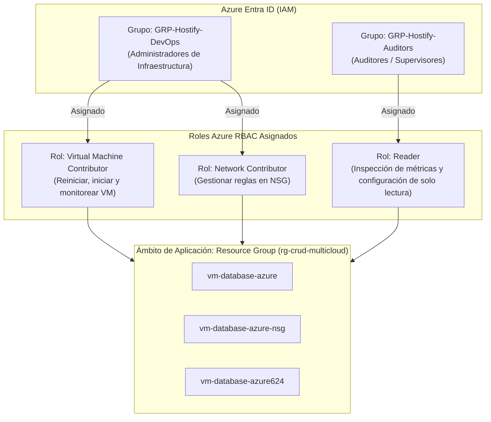

# 3. Configuración de Gestión de Identidades y Accesos (IAM en Azure y Aplicación Hostify)

## 3.1 Política de No Uso de Cuenta Raíz / Propietario en la Operación Diaria
En cumplimiento riguroso con los estándares **ISO/IEC 27001 (Control A.9.2.3)**, **NIST SP 800-53 (Control AC-6 Menor Privilegio)** y las directrices de la **Cloud Security Alliance (CSA IAM-01)**:

> [!IMPORTANT]
> **Regla Mandatoria de IAM Cloud:** La cuenta con rol `Owner` (Propietario de la suscripción) o `Global Administrator` en Azure Entra ID queda estrictamente resguardada para tareas de facturación y contingencias mayores (*Break-Glass*). Toda la gestión técnica de infraestructura, despliegue de la aplicación Hostify y monitoreo se delega a identidades y grupos operativos con permisos mínimos requeridos.

---

## 3.2 Estructura de Roles y Grupos en Azure Entra ID (Cloud RBAC)

Para la administración segura de la infraestructura en la nube donde opera Hostify Lite, se configuraron dos grupos de seguridad en **Azure Entra ID**, limitando su alcance exclusivamente al Grupo de Recursos `rg-crud-multicloud`:



### Detalle de Privilegios Delegados:
1. **GRP-Hostify-DevOps (Operación y Mantenimiento Técnico):**
   * **Roles Asignados:** `Virtual Machine Contributor` + `Network Contributor`.
   * **Permisos Habilitados:** Iniciar, reiniciar, apagar la VM `vm-database-azure`, verificar métricas de CPU/memoria y actualizar reglas del NSG ante incidentes.
   * **Restricción de Seguridad:** No poseen facultades para modificar suscripciones, ver costos de facturación, ni delegar permisos a terceros.
2. **GRP-Hostify-Auditors (Revisión de Seguridad y Auditoría Externa):**
   * **Rol Asignado:** `Reader`.
   * **Permisos Habilitados:** Inspeccionar el estado de la máquina, configuración del cortafuegos NSG y registros de Azure Monitor.
   * **Restricción de Seguridad:** Cero capacidad de escritura, apagado o alteración de configuraciones.

---

## 3.3 Configuración de Identidad Administrada (Managed Identity)
Para evitar el almacenamiento de secretos o contraseñas en archivos planos dentro del servidor de Hostify:
* Se habilitó la **Identidad Administrada Asignada por el Sistema (*System-Assigned Managed Identity*)** en la máquina virtual:
  ```bash
  az vm identity assign \
    --resource-group rg-crud-multicloud \
    --name vm-database-azure
  ```
* Este mecanismo permite a la máquina virtual autenticarse de forma nativa frente a servicios de Azure (como Azure Key Vault o Azure Blob Storage) utilizando tokens OAuth 2.0 dinámicos y rotativos emitidos por Microsoft Entra ID, dando cumplimiento al estándar **NIST SP 800-53 IA-2**.

---

## 3.4 Control de Acceso Basado en Roles en la Aplicación Hostify (App RBAC)

A nivel de software, Hostify Lite implementa una rigurosa **Separación de Funciones (*Separation of Duties - SoD*)** entre las labores cotidianas de recepción y las facultades de administración del hostal:

| Funcionalidad / Módulo de Hostify | Rol: `encargado` (Recepción) | Rol: `admin` (Administrador General) | Mecanismo de Seguridad y Control |
| :--- | :---: | :---: | :--- |
| **Inicio de Sesión y Dashboard General** | ✅ Permitido | ✅ Permitido | Sesión firmada con cookie segura `HttpOnly` y `SameSite=Lax`. |
| **Registro y Consulta de Huéspedes** | ✅ Permitido | ✅ Permitido | Sanitización estricta de entradas para evitar inyecciones. |
| **Creación y Visualización de Reservas** | ✅ Permitido | ✅ Permitido | Validación de disponibilidad y asignación de habitaciones. |
| **Consulta de Inventario de Habitaciones** | ✅ Permitido | ✅ Permitido | Vista del estado de ocupación para asignación inmediata. |
| **Cambio de Estado de Habitaciones** | ❌ Denegado | ✅ Permitido | Control exclusivo para mantenimiento, limpieza y habilitación. |
| **Gestión de Cuentas de Usuario (IAM)** | ❌ Denegado | ✅ Permitido | Creación de cuentas y asignación de roles del personal. |
| **Bitácora Centralizada de Auditoría** | ❌ Denegado | ✅ Permitido | Intentos de acceso denegados disparan alerta inmutable. |

### Demostración Técnica del Control RBAC en Código (`app/auth.py`):
```python
def role_required(*allowed_roles):
    """Decorador de seguridad para autorización basada en roles (RBAC)"""
    def decorator(view):
        @functools.wraps(view)
        def wrapped_view(**kwargs):
            user_role = session.get("role")
            if user_role not in allowed_roles:
                # Registro inmediato del intento no autorizado en la bitácora
                record_audit(
                    action="UNAUTHORIZED_ACCESS_ATTEMPT",
                    status="DENIED",
                    details=f"Acceso denegado a ruta '{request.path}' para usuario '{session.get('username')}' con rol '{user_role}'"
                )
                flash("Acceso denegado: Su rol no posee privilegios suficientes para este recurso (ISO 27001 A.9.4).", "danger")
                return redirect(url_for("routes.dashboard"))
            return view(**kwargs)
        return wrapped_view
    return decorator
```

### Protección de Credenciales y Manejo de Sesión:
* **Almacenamiento de Contraseñas:** Hostify Lite jamás almacena contraseñas en texto claro. Se utiliza el algoritmo **PBKDF2 con SHA-256** y salting aleatorio único mediante `werkzeug.security.generate_password_hash`.
* **Protección de Sesión:** Las cookies de sesión son firmadas criptográficamente con una clave secreta (`SECRET_KEY`), incorporando las banderas `HttpOnly` (previene robo de sesión mediante ataques XSS) y `SameSite=Lax` (previene ataques de falsificación de peticiones en sitios cruzados - CSRF).
