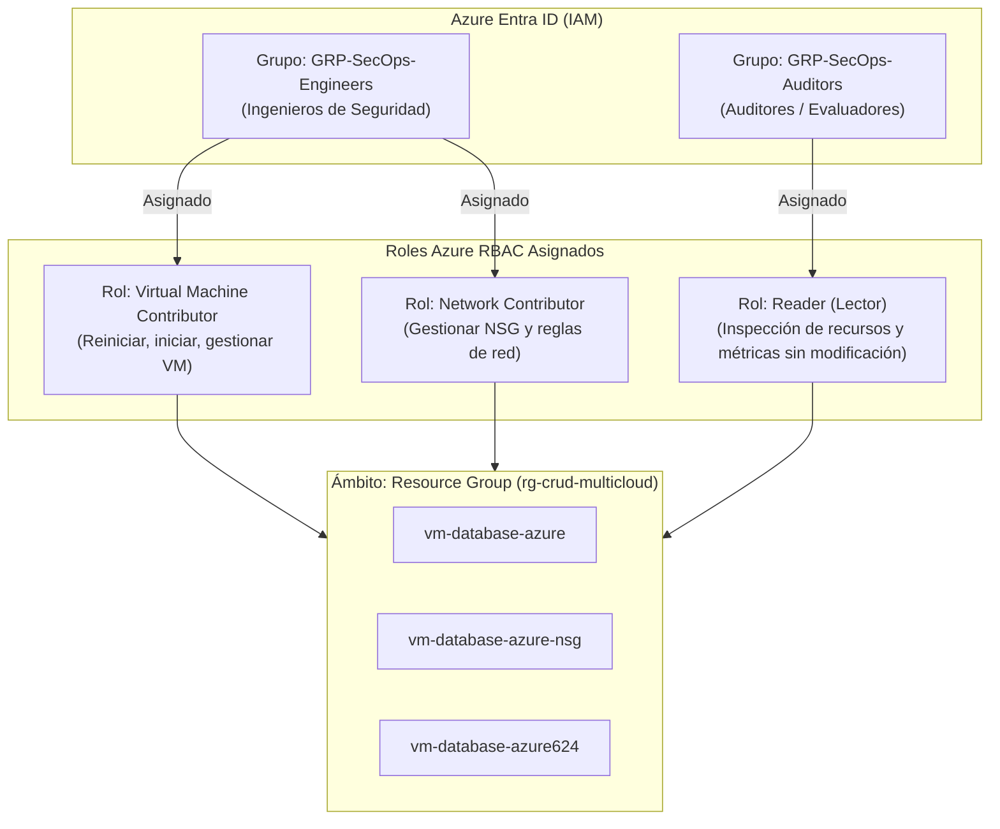

# 3. Configuración de Gestión de Identidades y Accesos (IAM en Azure y Aplicación)

## 3.1 Política de No Uso de Cuenta Raíz / Propietario en Operación Diaria
En cumplimiento con las directrices de **ISO/IEC 27001 (Control A.9.2.3)**, **NIST SP 800-53 (AC-6 Least Privilege)** y las mejores prácticas del **Cloud Security Alliance (CSA)**:

> [!IMPORTANT]
> **Regla de Oro de IAM Cloud:** La cuenta con rol `Owner` (Propietario de la suscripción) o `Global Administrator` en Azure Entra ID queda estrictamente restringida para tareas de facturación y contingencias mayores (*Break-Glass*). Toda la administración técnica, despliegue y monitoreo se realiza mediante usuarios y grupos operativos con permisos mínimos delegados.

---

## 3.2 Estructura de Roles y Grupos en Azure Entra ID (Cloud RBAC)

Se definen dos grupos de seguridad en Azure Entra ID con asignación de roles a nivel del Grupo de Recursos `rg-crud-multicloud`:



### Detalle de Roles Cloud:
1. **GRP-SecOps-Engineers (Operación Diaria)**:
   - **Rol:** `Virtual Machine Contributor` + `Network Contributor`.
   - **Permisos:** Iniciar, apagar, ver métricas y actualizar reglas en el NSG.
   - **Restricción:** No pueden asignar roles a otros usuarios, no pueden borrar la suscripción ni acceder a datos de facturación.
2. **GRP-SecOps-Auditors (Revisión y Auditoría Externa)**:
   - **Rol:** `Reader`.
   - **Permisos:** Visualizar estado de la infraestructura, configuraciones de red y logs de diagnóstico en Azure Monitor.
   - **Restricción:** Cero capacidad de modificación o apagado de servicios.

---

## 3.3 Configuración de Identidad Administrada (Managed Identity)
Para eliminar el almacenamiento de contraseñas o llaves de API en archivos de configuración planos:
* Se habilita la **System-Assigned Managed Identity** en la VM `vm-database-azure`:
  ```bash
  az vm identity assign \
    --resource-group rg-crud-multicloud \
    --name vm-database-azure
  ```
* Esto permite a la máquina autenticarse de manera nativa contra servicios de Azure (como Azure Key Vault o Azure Blob Storage para respaldos) utilizando tokens temporales emitidos por Azure Entra ID, satisfaciendo el estándar **NIST IA-2**.

---

## 3.4 Control de Acceso Basado en Roles en la Aplicación Web (App RBAC)

A nivel de software, el portal aplica una separación de funciones (*Separation of Duties*) validada por el decorador `@role_required` en Flask:

| Función / Recurso | Rol: `operador` | Rol: `admin` | Mecanismo de Seguridad |
| :--- | :---: | :---: | :--- |
| **Iniciar Sesión y Ver Dashboard** | ✅ Permitido | ✅ Permitido | Sesión cifrada con cookie `HttpOnly` y `SameSite=Lax`. |
| **Reportar Incidentes de Seguridad** | ✅ Permitido | ✅ Permitido | Validación y sanitización de entradas contra inyecciones. |
| **Cambiar Estado de Incidente** | ❌ Denegado | ✅ Permitido | Control exclusivo de administradores; auditado con ID de usuario. |
| **Gestionar Cuentas de Usuario (IAM)** | ❌ Denegado | ✅ Permitido | Restringido a CISO; genera evento `USER_CREATED` en bitácora. |
| **Consultar Bitácora de Auditoría** | ❌ Denegado | ✅ Permitido | Intento de acceso de operador dispara `UNAUTHORIZED_ACCESS_ATTEMPT`. |

### Demostración Técnica del Control en Código:
```python
def role_required(*allowed_roles):
    def decorator(view):
        @functools.wraps(view)
        def wrapped_view(**kwargs):
            if session.get("role") not in allowed_roles:
                record_audit(
                    action="UNAUTHORIZED_ACCESS_ATTEMPT",
                    status="DENIED",
                    details=f"Acceso denegado a ruta {request.path} para rol {session.get('role')}"
                )
                flash("Acceso denegado: Su rol no posee privilegios suficientes.", "danger")
                return redirect(url_for("routes.dashboard"))
            return view(**kwargs)
        return wrapped_view
    return decorator
```
Esto asegura que cualquier intento de escalada horizontal o vertical sea detectado y registrado inmediatamente para la auditoría de seguridad.
